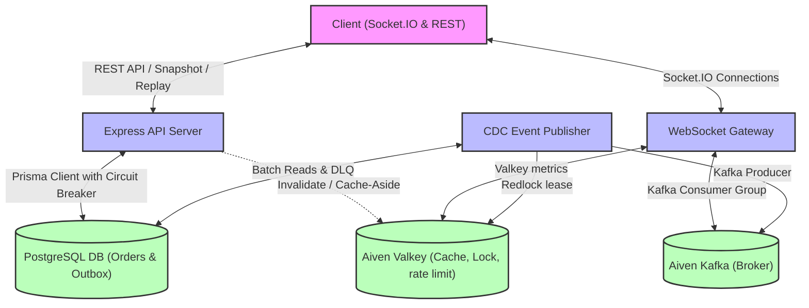
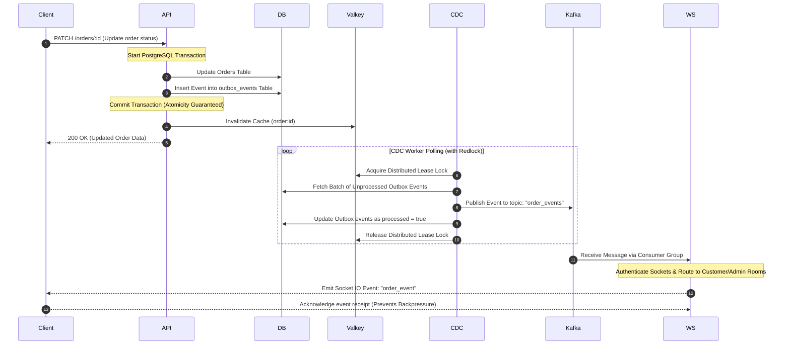
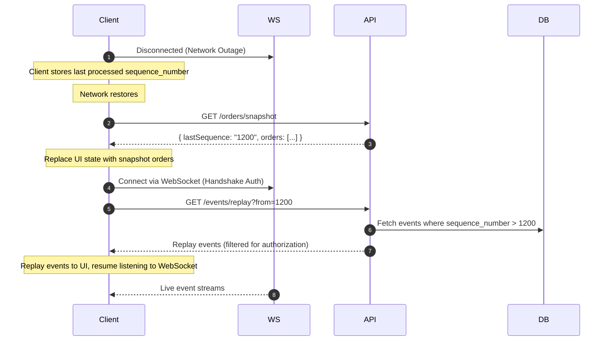

# Production-Grade Real-Time Database Change Notification System

This project is a resilient, production-ready, real-time database change notification system built using Node.js, TypeScript, PostgreSQL, Valkey (Redis-compatible), Aiven Kafka, Socket.IO, and Prisma ORM.

It implements the **Transactional Outbox Pattern** to ensure event delivery consistency and avoid dual-write anomalies, combined with a **CDC (Change Data Capture) Publisher**, **Aiven Kafka Backplane**, **Socket.IO Gateway**, **Cache-Aside Caching**, **Circuit Breakers**, and **Client State Reconciliation (Snapshot & Replay)**.

---

## System Architecture



---

## 17 Implemented Production-Grade Architectural Patterns

### 1. Transactional Outbox Pattern
* **Concept**: Data persistence (Orders table) and event publication queueing (`outbox_events` table) occur within the same ACID database transaction in PostgreSQL. This prevents dual-write anomalies (e.g., database update succeeds, but event publishing fails).
* **Implementation**: Managed in the [OrderService](file:///c:/Users/swaya/Downloads/realtime_data_synchronization_system/src/api/orderService.ts) using Prisma `$transaction`.

### 2. CDC / Event Publisher (Outbox Poller)
* **Concept**: A separate service continuamente reads the outbox table in batches, publishes the events, and marks them as processed in the database only *after* successful publication.
* **Implementation**: Implemented in [outbox/index.ts](file:///c:/Users/swaya/Downloads/realtime_data_synchronization_system/src/outbox/index.ts).

### 3. Idempotent Event Processing
* **Concept**: Consumer connections use the unique `eventId` and sequence numbers to deduplicate event packets and reject duplicate deliveries.
* **Implementation**: Validated in the WebSocket broker and [testClient.ts](file:///c:/Users/swaya/Downloads/realtime_data_synchronization_system/src/shared/testClient.ts).

### 4. WebSocket Gateway
* **Concept**: Socket.IO handles persistent client connections, routes real-time broadcasts, and handles transport reconnects.
* **Implementation**: Implemented in [websocket/index.ts](file:///c:/Users/swaya/Downloads/realtime_data_synchronization_system/src/websocket/index.ts).

### 5. Aiven Kafka Broker Layer
* **Concept**: Replaced local Redis Pub/Sub with Aiven Kafka topics and consumer groups to coordinate the event fan-out between CDC publisher instances and multiple WebSocket gateway nodes.
* **Implementation**: Managed in [kafka.ts](file:///c:/Users/swaya/Downloads/realtime_data_synchronization_system/src/infrastructure/kafka.ts).

### 6. Client State Reconciliation (Snapshot & Replay API)
* **Concept**: When a client connects or reconnects, it retrieves a consistent snapshot of the current state along with the `lastSequence` number. It then queries the Replay API to pull missed events starting from that sequence number.
* **Implementation**: API routes `/orders/snapshot` and `/events/replay` in [api/index.ts](file:///c:/Users/swaya/Downloads/realtime_data_synchronization_system/src/api/index.ts).

### 7. Exactly-Once Delivery Strategy
* **Concept**: Achieved using **At-Least-Once Delivery** (CDC retries + Kafka commits) combined with **Idempotent Consumers** (deduplication based on unique event IDs and sequence numbers).
* **Implementation**: Coordinated between [websocket/index.ts](file:///c:/Users/swaya/Downloads/realtime_data_synchronization_system/src/websocket/index.ts) and [testClient.ts](file:///c:/Users/swaya/Downloads/realtime_data_synchronization_system/src/shared/testClient.ts).

### 8. Dead Letter Queue (DLQ)
* **Concept**: If an outbox event repeatedly fails to publish to Kafka (up to 3 attempts), the publisher moves the event to the `dead_letter_events` table alongside the failure reason, preventing poison messages from blocking the CDC queue.
* **Implementation**: Method `moveToDLQ` in [outbox/index.ts](file:///c:/Users/swaya/Downloads/realtime_data_synchronization_system/src/outbox/index.ts) and exposed via `/dlq`.

### 9. Backpressure & Flow Control
* **Concept**: If a client is slow or has dropped connections, event updates queue up. If the queue size exceeds a threshold, the gateway drops new events and emits a `CLIENT_BACKPRESSURE` warning.
* **Implementation**: Handled in [websocket/index.ts](file:///c:/Users/swaya/Downloads/realtime_data_synchronization_system/src/websocket/index.ts).

### 10. Rate Limiting
* **Concept**: Rate limits protect REST endpoints and WebSocket handshakes using Valkey. Enforces IP-based limits for public resources and client-based limits for authenticated requests.
* **Implementation**: Middlewares defined in [rateLimiter.ts](file:///c:/Users/swaya/Downloads/realtime_data_synchronization_system/src/shared/rateLimiter.ts).

### 11. Circuit Breakers
* **Concept**: Uses the **Opossum** library to monitor database and Valkey access. If failure rates cross the 50% threshold, the circuit opens to fail-fast, preventing connection pool starvation.
* **Implementation**: Implemented in [circuitBreaker.ts](file:///c:/Users/swaya/Downloads/realtime_data_synchronization_system/src/infrastructure/circuitBreaker.ts).

### 12. Graceful Degradation & Fail-Open
* **Concept**: If Valkey is down, the rate limiter fails open to allow authenticated traffic, and orders are retrieved directly from the database (bypassing cache-aside). The CDC worker halts outbox processing until Valkey recovers.
* **Implementation**: Handled in [circuitBreaker.ts](file:///c:/Users/swaya/Downloads/realtime_data_synchronization_system/src/infrastructure/circuitBreaker.ts) and [rateLimiter.ts](file:///c:/Users/swaya/Downloads/realtime_data_synchronization_system/src/shared/rateLimiter.ts).

### 13. CDC Lag Monitoring & Metrics
* **Concept**: Exposes `GET /metrics` showing outbox lag count, age of oldest unprocessed event in seconds, count of connected clients, events-per-second, and circuit breaker health statuses.
* **Implementation**: Monitored in [lagMonitor.ts](file:///c:/Users/swaya/Downloads/realtime_data_synchronization_system/src/monitoring/lagMonitor.ts) and [redisMetrics.ts](file:///c:/Users/swaya/Downloads/realtime_data_synchronization_system/src/monitoring/redisMetrics.ts).

### 14. Distributed Locking (Redlock)
* **Concept**: Uses Valkey Redlock leases to coordinate CDC publisher worker replicas, ensuring only a single active instance is querying and marking outbox batches at any given time.
* **Implementation**: Polling loop in [outbox/index.ts](file:///c:/Users/swaya/Downloads/realtime_data_synchronization_system/src/outbox/index.ts).

### 15. Schema Evolution
* **Concept**: Events contain `eventVersion` fields. Sockets and consumers can support legacy v1 event structures, which are automatically upgraded to v2 payloads before routing.
* **Implementation**: Transformer in [eventTypes.ts](file:///c:/Users/swaya/Downloads/realtime_data_synchronization_system/src/events/eventTypes.ts).

### 16. Authentication & Authorization Propagation
* **Concept**: Handshakes and REST APIs are protected using JWTs. Clients are isolated into rooms (e.g. `room:customer:username`), preventing Customer A from receiving Customer B's order events.
* **Implementation**: Configured in [jwt.ts](file:///c:/Users/swaya/Downloads/realtime_data_synchronization_system/src/auth/jwt.ts) and verified in [websocket/index.ts](file:///c:/Users/swaya/Downloads/realtime_data_synchronization_system/src/websocket/index.ts).

### 17. Cache-Aside Pattern
* **Concept**: API reads for `GET /orders/:id` lookup in Valkey first. Misses query the database, populate the cache, and set a TTL. Writes/Deletes invalidate the cached entity immediately.
* **Implementation**: Managed in [orderCache.ts](file:///c:/Users/swaya/Downloads/realtime_data_synchronization_system/src/cache/orderCache.ts).

---

## Message Flow Sequences

### 1. Order Update & CDC Publication Flow
This sequence demonstrates how a transactional write ensures that order changes and outbox events are written atomically, preventing lost updates.



### 2. Client Reconnection & State Reconciliation Flow
When a client drops connection, it uses the Snapshot and Replay APIs to catch up to the latest sequence number without missing any changes.



---

## Quick Start & Setup

### Requirements
* Node.js (v18+) & npm
* Aiven Account (with PostgreSQL, Valkey, and Kafka clusters running)

### Setup Configurations
1. **Configure the `.env` file**:
   Open the [.env](file:///c:/Users/swaya/Downloads/realtime_data_synchronization_system/.env) file and populate your database, Valkey connection strings, and Kafka broker details.
2. **Push database schema**:
   ```bash
   npx prisma db push
   ```
3. **Start services**:
   ```bash
   # Terminal 1: Express REST API (Port 3000)
   npm run start:api

   # Terminal 2: Socket.IO WebSocket Gateway (Port 3001)
   npm run start:ws

   # Terminal 3: CDC Outbox Publisher
   npm run start:publisher
   ```
4. **Run Integration / Verification Client**:
   ```bash
   # Executes client authentication, CRUD, snapshot, reconnect, replay, and backpressure simulation
   npx ts-node src/shared/testClient.ts
   ```
